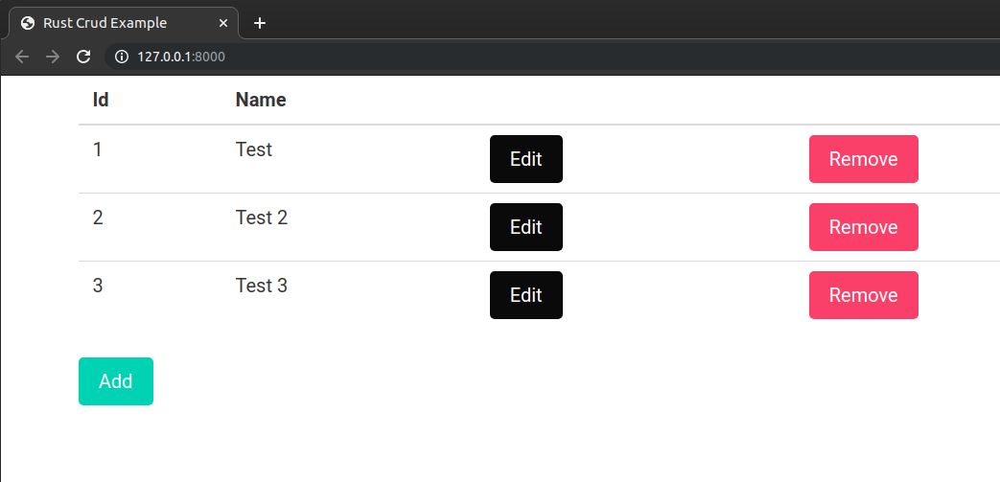

# Rust CRUD



Basic CRUD (Create, Read, Update, Delete) [Rust] application with [Yew Framework]

[Rust]: https://www.rust-lang.org
[Yew Framework]: https://github.com/yewstack/yew

## Getting Started

You need to [install Rust] and [cargo-web] then:

```bash
$ git clone https://github.com/joselo/rust-crud
$ cd rust-crud
$ cargo web start --auto-reload
```

Then you can access the web server at `http://127.0.0.1:8000`.

[install Rust]: https://www.rust-lang.org/tools/install
[cargo-web]: https://github.com/koute/cargo-web

## Authors

* **Jose Carrion** - *Initial work* - [Joselo](https://github.com/joselo)

## License

This project is licensed under the MIT License - see the [LICENSE.md](LICENSE.md) file for details
