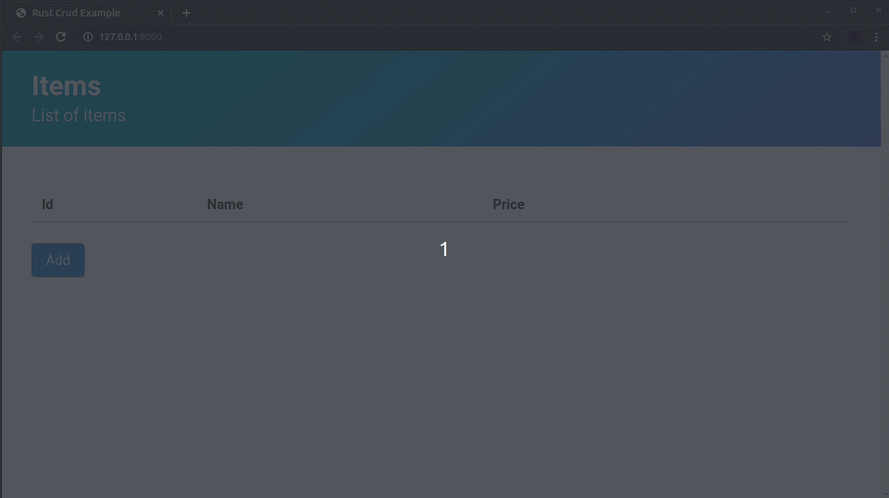

# Rust CRUD



Basic CRUD (Create, Read, Update, Delete) [Rust] application with [Yew Framework] that uses WebAssembly :heart_eyes:.
I'm still learning rust, so the app has some minor issues, but it general it works to show you an approach of Yew and Rust.

[Rust]: https://www.rust-lang.org
[Yew Framework]: https://github.com/yewstack/yew

## Current Features

* Create, update and delete items
* Local Storage
* Validations
* Modal Window

### Future Features

* Confirm dialog
* Filters
* Pagination

## Getting Started

You need to [install Rust] and [Trunk] then:

```bash
$ git clone https://github.com/joselo/rust-crud
$ cd rust-crud
$ trunk serve
```

Then you can access the web server at `http://127.0.0.1:8080`.

[install Rust]: https://www.rust-lang.org/tools/install
[Trunk]: https://github.com/thedodd/trunk

## Authors

* **Jose Carrion** - *Initial work* - [Joselo](https://github.com/joselo)

## License

This project is licensed under the MIT License - see the [LICENSE.md](LICENSE.md) file for details
